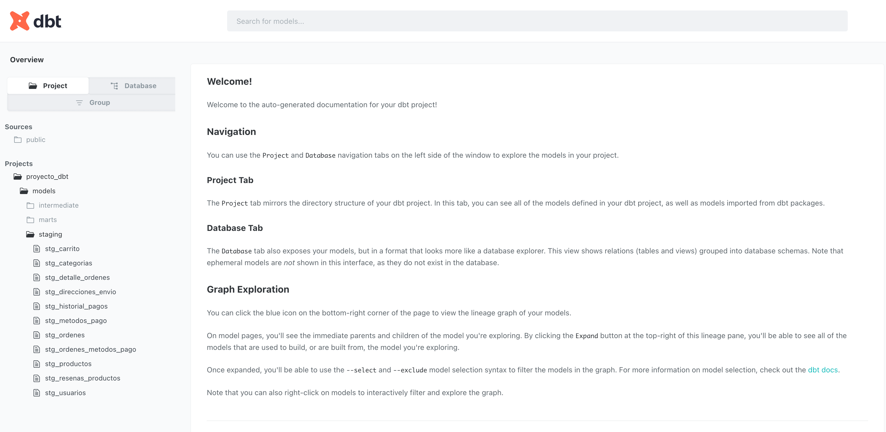
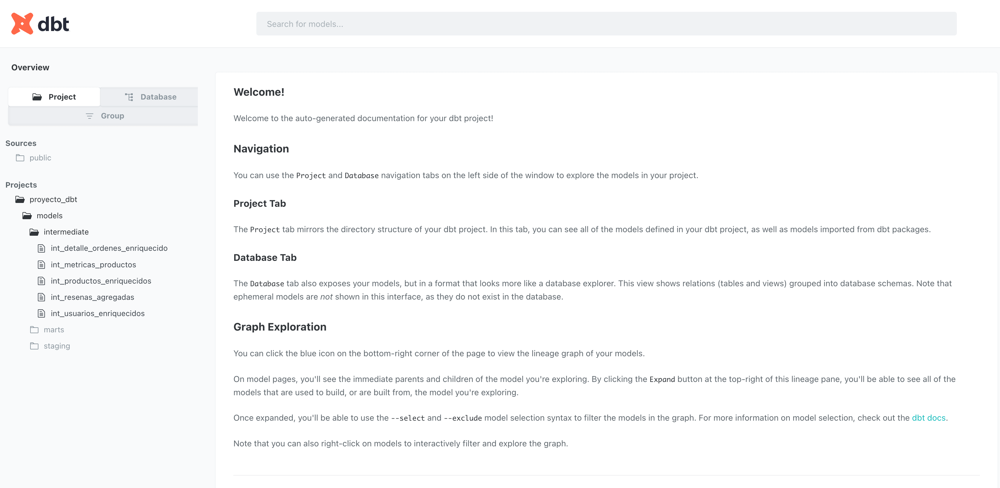
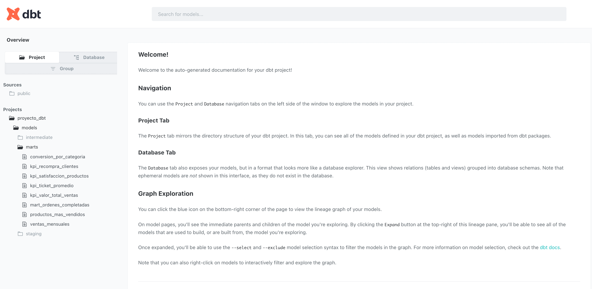
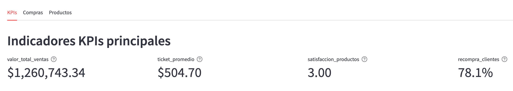
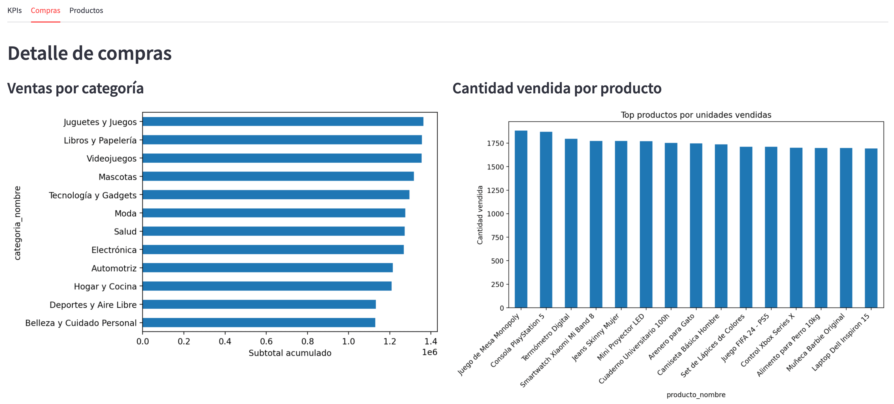
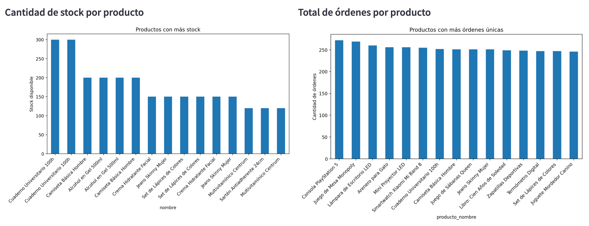
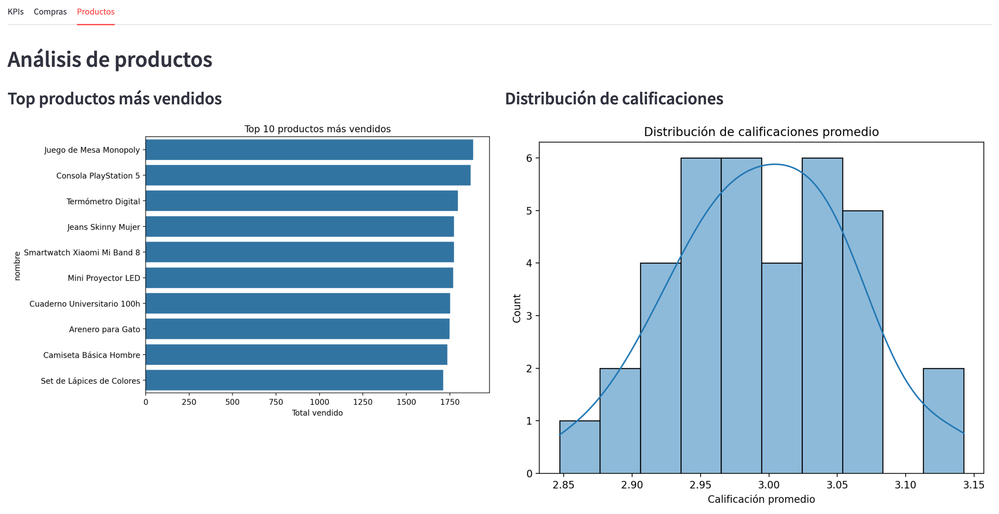
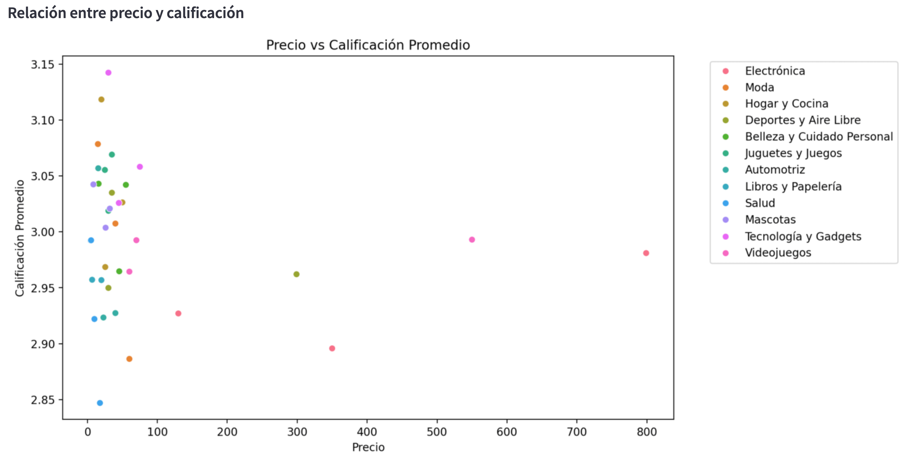
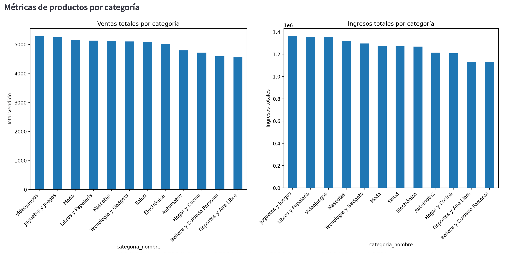

# EcommerceDB - Generación de Esquema con SQLAlchemy, PostgreSQL y DBT

Este proyecto permite modelar, crear y analizar una base de datos para un entorno de comercio electrónico. Utiliza **SQLAlchemy** para la creación de esquemas, **PostgreSQL** como motor de base de datos y **DBT** para modelado analítico (Data Warehouse).
Desarrollado por **Diego Lopez Castan**.

---

## Tecnologías utilizadas

- Python 3.8+
- PostgreSQL
- SQLAlchemy
- DBT (Data Build Tool)
- Docker y Docker Compose
- PgAdmin

---

## Estructura del Proyecto

```
.
├── Proyecto_IntegradorII_ Diego_Lopez_Castan.pdf         # Descripcion y objetivos del proyecto
├── dashboard                  # Esta el dashboard de Streamlit
├── docker-compose.yml         # Levanta contenedores para PostgreSQL y PgAdmin
├── .env                       # Variables de entorno para configuración de Docker
├── README.md                  # Documentación del proyecto
├── requirements.txt           # Dependencias de Python
├── db_conector.py             # Conexión a la base de datos con SQLAlchemy
├── main.py                    # Script principal para crear tablas
├── modelos.py                 # Modelos ORM con SQLAlchemy
├── scripts_postgresql/        # Scripts SQL puros para creación de tablas
│   ├── carrito_postgres.sql
│   ├── categorias_postgress.sql
│   ├── metodos_pago_postgres.sql
│   ├── historial_pagos_postgres.sql
│   ├── productos_postgres.sql
│   └── resenas_productos_postgres.sql
├── proyecto_dbt/              # Proyecto DBT para modelado en capas (medallón)
│   ├── dbt_project.yml        # Configuración principal de DBT
│   ├── models/
│   │   ├── staging/           # Modelos intermedios (stg)
│   │   ├── intermediate/      # Transformaciones agregadas (int)
│   │   └── marts/             # Modelos de negocio (mart)
│   ├── macros/                # Macros reutilizables en DBT
│   └── tests/                 # Tests para validación de datos
└── dbt_profiles/              # Perfil de conexión DBT
    └── profiles.yml
```

---
# Documento de Proyecto (PDF)
El archivo PDF incluido detalla todo el desarrollo conceptual y técnico del proyecto. Contiene la definición del objetivo general, las preguntas clave de negocio, los principales KPIs implementados, el modelo dimensional propuesto (siguiendo la metodología de Kimball), la explicación de las capas de la arquitectura medallón (Bronze, Silver y Gold) y cómo se utilizan con DBT. También documenta las fuentes de datos, la estructura de la base transaccional y los modelos analíticos construidos para facilitar la toma de decisiones basada en datos.

Podes ver el archivo en [ver documento completo del proyecto](/Proyecto_IntegradorII_%20Diego_Lopez_Castan.pdf
)


# Documentación de Modelos SQL - Proyecto DBT

## Modelado en capas (Arquitectura Medallón con DBT)

- `staging`: Limpieza y estandarización de datos desde las tablas base.
- `intermediate`: Agregaciones o uniones.
- `marts`: Métricas de negocio listas para reportes (ej: órdenes completadas, ventas mensuales, etc.)

## Modelos de Staging (`stg_`)
Estos modelos limpian, transforman y estandarizan los datos extraídos de las fuentes para dejarlos listos para el análisis:

### stg_carrito.sql
**Descripción:** Prepara los datos del carrito de compras, probablemente para analizar la conversión o comportamiento del cliente.

### stg_categorias.sql
**Descripción:** Normaliza o categoriza los productos en la base de datos para análisis por categoría.

### stg_detalle_ordenes.sql
**Descripción:** Desglosa cada orden en sus productos individuales, útil para análisis de ventas y comportamiento de compra.

### stg_direcciones_envio.sql
**Descripción:** Establece las direcciones de envío asociadas a las órdenes o usuarios.

### stg_historial_pagos.sql
**Descripción:** Contiene datos del historial de pagos realizados por los usuarios, útil para análisis financiero.

### stg_metodos_pago.sql
**Descripción:** Relaciona los métodos de pago utilizados por los clientes.

### stg_ordenes_metodos_pago.sql
**Descripción:** Relaciona los métodos de pago utilizados por los clientes.

### stg_ordenes.sql
**Descripción:** Vista que representa las órdenes realizadas por los usuarios.

### stg_productos.sql
**Descripción:** Contiene información sobre los productos disponibles o vendidos.

### stg_resenas_productos.sql
**Descripción:** Contiene información sobre los productos disponibles o vendidos.

### stg_usuarios.sql
**Descripción:** Contiene información de los usuarios registrados, probablemente para análisis de comportamiento.

## Modelos Intermedios (`int_`)
Modelos que integran datos provenientes de múltiples fuentes o realizan agregaciones para enriquecer la información:

### int_usuarios_enriquecidos.sql
**Descripción:** Vista intermedia que enriquece los datos de los usuarios con información adicional como comportamiento, compras o ubicaciones.

### int_resenas_agregadas.sql
**Descripción:** Agrega o consolida las reseñas por producto o por usuario, útil para calcular promedios, conteos o clasificaciones.

### int_productos_enriquecidos.sql
**Descripción:** Vista que une información básica de productos con otras fuentes como categorías, métricas o reseñas.

### int_metricas_productos.sql
**Descripción:** Calcula métricas clave por producto como promedio de calificación, cantidad de ventas, reseñas u otros indicadores.

### int_detalle_ordenes_enriquecido.sql
**Descripción:** Vista detallada de órdenes con información adicional como datos del producto, usuario o reseña.

## Modelos de Capa Mart (`mart_` y KPIs)
Modelos analíticos diseñados para exponer métricas de negocio y facilitar su consumo por parte de analistas:

### ventas_mensuales.sql
**Descripción:** Modelo que calcula las ventas mensuales agregadas, útil para análisis de crecimiento y estacionalidad.

### productos_mas_vendidos.sql
**Descripción:** Identifica los productos con mayor volumen de ventas, útil para decisiones de stock y marketing.

### mart_ordenes_completadas.sql
**Descripción:** Contiene todas las órdenes que fueron completadas con éxito, consolidando información clave para análisis comercial.

### kpi_valor_total_ventas.sql
**Descripción:** Calcula el valor total de las ventas realizadas, una métrica financiera central del negocio.

### kpi_ticket_promedio.sql
**Descripción:** Métrica que estima el ticket promedio por orden, ayudando a evaluar el comportamiento de compra.

### kpi_satisfaccion_productos.sql
**Descripción:** KPI que evalúa la satisfacción de los productos a partir de las reseñas o calificaciones recibidas.

### kpi_recompra_clientes.sql
**Descripción:** Métrica que indica la tasa de recompra por parte de los clientes, útil para medir fidelización.


### conversion_por_categoria.sql
**Descripción:** Muestra la tasa de conversión segmentada por categoría de producto, ayudando a identificar oportunidades de mejora en el catálogo.


## Instalación

1. Cloná el repositorio o descargá el proyecto.
2. (Opcional) Creá un entorno virtual:

```bash
python -m venv venv
source venv/bin/activate     # Linux/macOS
venv\Scripts\activate        # Windows
```

3. Instalá las dependencias:

```bash
pip install -r requirements.txt
```

4. Luego correr el siguiente comando: 

```bash
pip install --upgrade pip
```
---

## Despliegue con Docker

1. Crea el archivo  `.env` y personalizalo si es necesario. Ejemplo:
```bash
POSTGRES_DB=EcommerceDB
POSTGRES_USER=admin
POSTGRES_PASSWORD=dept01
PGADMIN_DEFAULT_EMAIL=admin@admin.com
PGADMIN_DEFAULT_PASSWORD=admin123
```
2. Ejecutá:

```bash
docker-compose up -d
```

3. Accedé a:
- PostgreSQL en `localhost:5432`
- PgAdmin en `http://localhost:8080`

---

# main.py – Administrador de scripts SQL

Este script permite ejecutar operaciones sobre la base de datos PostgreSQL de manera ordenada y controlada. Utiliza `SQLAlchemy` para la conexión y ejecución de scripts, y se apoya en un conjunto de archivos `.sql` ubicados en el directorio `scripts_postgresql`.

## Funcionalidades disponibles

Al ejecutar `main.py`, se presentan tres opciones interactivas:

1. **Crear tablas**  
   Ejecuta el script `1.Create_ddl_postgres.sql` para generar las estructuras de tablas en la base de datos.

2. **Cargar datos**  
   Ejecuta secuencialmente una lista predefinida de scripts SQL (por ejemplo, `usuarios`, `productos`, `ordenes`, etc.), respetando el orden lógico para evitar errores por claves foráneas.

3. **Eliminar todas las tablas e índices**  
   Elimina todos los índices (excepto los del sistema) y tablas del esquema, utilizando `DROP ... CASCADE`.

## Organización

- Todos los scripts deben estar ubicados en la carpeta `scripts_postgresql`.
- El orden de ejecución de los scripts está definido en la lista `SCRIPT_ORDER`.

## Requisitos

- Tener configurado el archivo `db_conector.py` con la función `get_db_engine()` que devuelve un engine válido de SQLAlchemy.
- Acceso a una base de datos PostgreSQL.

## Ejecución

```bash
python main.py
```

### Modelado analítico con DBT

Para ver el dbt primero hay que ir al directorio que se llama proyecto_dbt

1. Modificar el archivo /Users/miusuario/.dbt/profiles.yml con los datos propios. Ejemplo:

```bash
default:
  target: dev
  outputs:
    dev:
      type: postgres
      host: localhost
      user: admin
      password: dept01
      port: 5432
      dbname: EcommerceDB
      schema: public
      threads: 4
```

2. Correr los comandos dbt

```bash
cd proyecto_dbt
dbt run
dbt test
```

dbt run
Ejecuta todos los modelos definidos en el proyecto. Crea vistas o tablas en la base de datos según lo especificado en la configuración.

dbt test
Corre todos los tests definidos en los archivos .yml (como not_null, unique, relationships, etc.). Sirve para validar la calidad    e integridad de los datos.

dbt docs generate
Genera la documentación del proyecto DBT, incluyendo descripciones de modelos, columnas, tests y relaciones entre tablas. Crea un sitio HTML estático en la carpeta target/.

dbt docs serve --port 8081
Lanza un servidor local para navegar por la documentación generada. Podés acceder desde tu navegador en http://localhost:8081.


### Documentacion DBT

La arquitectura medallón es un paradigma de lakehouse que organiza los datos en tres capas progresivas (Bronze, Silver y Gold), donde cada nivel agrega valor y refinamiento a los datos. Esta aproximación permite un balance óptimo entre flexibilidad, calidad y performance, facilitando tanto el análisis exploratorio como los casos de uso empresariales críticos.

La capa Bronze actúa como el punto de entrada de todos los datos al data lakehouse, preservando la fidelidad de la información original.

La capa Silver transforma los datos brutos en información confiable y estructurada, aplicando reglas de negocio y estándares de calidad.

La capa Gold representa el nivel más refinado de datos, optimizada específicamente para el consumo analítico y la toma de decisiones empresariales.


### Documentacion DBT






Podes ver el archivo con los tests en el siguiente link ->  [documento resultado tests](/assets/resultado_dbt_test.txt
)

---

## Ver base de datos en PgAdmin

1. Abrí [http://localhost:8080](http://localhost:8080)
2. Registrá el servidor con:
   - **Host:** db
   - **Database:** EcommerceDB
   - **User:** admin
   - **Password:** admin123

---

## Dashboard

Para ver los diferentes resultados cree un dashboard con la herramienta de Streamlit en cual cuenta con tres pestañas. Todos los datos son obtenidos desde las distintas vistas creadas en el modelado y las tranformaciones DBT. 
La primera como muestra la imagen se ven los cuatro kpis seleccionado.
En el segundo tab se pueden ver algunos gráficos de las compras por ejemplo:
Ventas por categorias
Cantidad vendida por producto
Cantidad de stock por producto
Total de órdenes por producto
Cantidad vendida vs. Precio del producto

Por último en el tercera tab vamos a poder ver los diferentes gráficos relacionados con los productos. Entre ellos podemos ver:
Top productos más vendidos.
Distribución de calificaciones promedio.
Precio vs calificación.

### Dashboard KPI


### Dashboard Compras

En el dashboard de compras se pueden ver cuatro graficos:
* Ventas por categoría
* Cantidad vendida por producto
* Cantidad de Stock por productos
* Total de órdenes por producto






### Dashboard Productos

En el dashboard de productos se pueden ver cuatro graficos:
* Top productos más vendidos
* Distribución de las calificaciones
* Relación entre precio y calificación por categoría
* Ventas e ingresos por categoría







### Ejecutar el dashboard

1. Ir al directorio dashboard
2. Correr el programa streamlit para generar el dashboard

```bash
streamlit run dashboard_streamlit.py
```

## Créditos

Desarrollado por **Diego Lopez Castan** como ejercicio integrador entre desarrollo de esquemas, SQL puro y modelado analítico con DBT.

---

## Licencia

Uso libre para fines educativos y personales.
